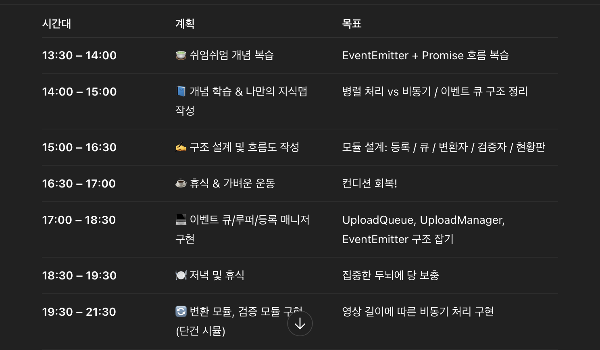

## 브레인 스토밍 주제

> README의 정체성 및 목표를 유지하면서 어떤 퀘스트를 추가로 제공할 것인가?

---

## 토론 참여자

- S027\_이재영
- J206\_이인희
- J232\_임장혁
- J251\_조성민

---

## 주요 토론 내용

- 현재 작성되어있는 README의 기조를 유지할 것인가? → ✅
- 중복된 퀘스트를 허용하지 않을것인가? → ✅
- 현재 README 노트에서 기재된 정체성과 목표가 무엇인지
- 지난 주차의 퀘스트들이 의미하는것과 기대하는것이 무엇인지

> 저희는 기존 READEM에 기술된 정체성 및 목표인 학습 효율성 극대화와, 더 똑똑하게 성장하는 방법을 유지한체 또 다른 퀘스트를 생성하기로 했습니다

---

## 퀘스트 목록

### ✅ 퀘스트1: AI를 사용해 내 학습 내용을 기반으로 학습 길잡이의 ‘스스로 확인해볼 사항’에 대한 답변 생성하기

배경: 피어 피드백 시간에 자신의 학습 내용을 즉석에서 설명하고 전달하는 것에 어려움을 겪는 경우가 많다.

목적: 피어 피드백 시간에 학습 목표와 관련된 내용을 명확하게 전달하기 위해 AI의 도움을 받는다. AI로 생성한 내용을 바탕으로 본인의 학습 내용과 구현 과정에서 이를 반영한 부분을 동료들과 공유할 수 있다.

달성기준:

- AI에게 README와 학습정리 내용을 전달하고, 이를 기반으로 ‘스스로 확인해볼 사항’ 항목들에 대한 답변 생성을 의뢰한다.
- 생성한 내용을 피어 피드백 시간에 팀원들과 공유한다.

### ✅ 퀘스트2: 미션 관련 영어 질문, 영문 글을 찾아서 번역 및 분석 부탁해서 학습하기

- 배경: stack overflow, geeksforgeeks 등 많은 개발자 커뮤니티가 있는데, 커뮤니티 안에는 좋은 질문과 답변들이 많다. 하지만 영어로 되어 있어서 해석하는데 시간이 걸리고, 해석하더라도 검증된 내용인지 헷갈림. → 누군가가 가공한 한국어 자료를 찾게 됨.
- 목적: 영문으로 된 좋은 글을 찾아서 학습하는 것을 목적에 둔다. 많은 프로그래밍 언어가 해외에서 개발된 만큼 그리고 영문으로 된 공식 문서가 많은 만큼 좋은 영문 자료는 많다. 이를 선별, 학습하고 좋은 글을 찾는 능력을 키우는 것이 목적.
- 상세 퀘스트:
  - 영문으로 된 글을 찾아서 AI에게 번역, 분석, 해설 부탁하기
  - AI로부터 얻은 내용을 바탕으로 좋은 글인지, 검증된 내용인지 판단하기
  - 이러한 과정 또는 얻은 내용을 정리해서 기록하기

### ✅ 퀘스트3: AI 페이스 메이커

- 배경: 힘든 챌린지 과정에서 무작정 열심히 하는 것보단, 나의 컨디션과 과제 난이도에 맞춰 전략적으로 시간을 분배하는것도 중요합니다.
- 목적 : AI를 개인의 학습 리듬을 조절해주는 페이스메이커로 활용하여, 건강한 학습 계획을 세우고 실천합니다
- 상세 퀘스트:
  - AI에게 “나는 오늘 [오늘의 미션]을 해야하고, 현재 컨디션은 [컨디션 상태에 대한 서술] 상태야. 나의 컨디션을 분석해서 미션을 언제 어떻게 처리하면 좋을지 포함해서 오늘 하루의 학습 시간표를 짜줘” 라는 프롬포트를 전달합니다
  - AI가 제안한 시간표와 실제 수행과정을 비교하여 적절한 학습 리듬을 찾아봅니다.

### ✅ 퀘스트4 : 학습 로드맵 만들기

- 배경: 하나의 미션에 파생된 여러 CS 지식을 학습하다 보면, 관련된 개념을 어느정도 더 깊게 파고들어야할지, 다음 단계로 어떻게 나아갈지 어려울때가 많습니다.
- 목적: 현재 학습한 내용을 기반으로 AI에게 다음 학습 목표 및 단계를 추천받아 자기주도적인 학습에 도움을 주도록 합니다
- 상세 퀘스트:
  - 현재까지 학습이 완료된 부분들과 오늘의 미션을 AI에게 알려줍니다
  - 미션을 위해 더 학습해야하거나 다음 단계에 뭘 하면 좋을지 AI에게 추천받습니다
  - 추천받은 내용중 자신이 원하는 항목을 선택하여, 학습합니다

 
 

## 🏃🏻‍➡️🏃🏻‍♀️‍➡️ 수행과정

### 퀘스트 선정 및 선정 이유

### 🧩 S011 박재규 - 퀘스트3: AI 페이스 메이커

**🤔 선정이유**

평소 저는 학습 계획을 세우기보다는 그날그날 해야 할 일이 생각나는 대로 진행하는 편입니다. 순간의 집중력에 의존해 학습하다 보니 체력이나 컨디션이 좋지 않은 날에는 쉽게 지치고 반대로 에너지가 넘치는 날에도 과하게 몰입하다가 금방 번아웃을 겪기도 했습니다. 특히 여러 가지 과제를 병행해야 할 때는 어떤 과제에 얼마만큼의 시간을 투자해야 할지 판단하기 어려워서 비효율적인 시간 분배가 자주 일어났습니다.

이러한 학습 습관의 문제를 인식하면서, 좀 더 전략적으로 나의 컨디션과 과제 난이도에 따라 학습 리듬을 조절해보는 것이 필요하다고 느꼈습니다. 그래서 AI의 도움을 받아 나의 컨디션과 학습 내용을 함께 고려한 ‘맞춤형 학습 시간표’를 세우고 실제 실행을 통해 적절한 리듬을 찾아가보고자 이 퀘스트를 선택하게 되었습니다.

---

### 🎁 J216 이진희 - 퀘스트3: AI 페이스 메이커

**🤔 선정이유**

지난 2주를 돌아보면, 주말이 가까워질수록 피로가 누적되어 컨디션이 최악이었고, 이는 미션 수행에도 영향을 줬습니다. 하루에 2~3시간밖에 자지 못하고 미션을 이어갔지만, 노력에 비해 능률이 오르지 않아 나 자신에 대한 관리가 필요하다고 느꼈습니다.

남은 2주 동안 학습과 구현의 밸런스를 맞추는 것도 중요하지만, 건강을 지키면서 지속 가능하게 달리는 전략이 필요하다고 판단했습니다. 이제는 무작정 열심히 하기보다, AI를 활용해 나의 컨디션과 미션의 난이도를 고려한 전략적 시간 계획을 세워보려 합니다.

끝까지 최선을 다하기 위해, ‘나만의 페이스’를 찾는 시도이자 도전으로 이 퀘스트를 선택하게 되었습니다.

|           | 월  | 화  | 수  | 목  |
| --------- | --- | --- | --- | --- |
| 달성 여부 | O   |     |     |     |

  
월요일

- 중간중간 휴식시간이 포함된 시간표를 만들어주었음
- 중간중간 휴식을 취했지만 늦게 자게 됨 ㅠ
  

  
화요일

  
수요일

  
목요일

---

### J303 김동규 - 퀘스트4: 학습 로드맵 만들기

**🤔 선정이유**

2주차에 여러 AI모델을 이용해 학습을 진행했는데 지식을 습득하기 위한 계획 설립에 도움을 받았을 때 가장 순조롭게 나아갔던 경험이 있습니다.

여기에 현재 지식 수준을 추가로 피드백한다면 더욱 효율적인 균형을 찾을 수 있을 거라 생각하기에 확인해보려 합니다.

|           | 월  | 화  | 수  | 목  |
| --------- | --- | --- | --- | --- |
| 달성 여부 |     |     |     |     |

### J259 주장권 - 퀘스트4: 학습 로드맵 만들기

**🤔 선정 이유**

지난 미션들을 진행하면서, 어떤 개념을 깊게 파고들어야 할지 혹은 어디서 멈추고 다음 단계로 넘어가야 할지 헷갈릴 때가 많았습니다. 특히 한 가지 주제를 공부하다 방향을 잃기도 했습니다.
그래서 AI에게 내가 학습한 내용과 현재 미션을 알려주고, 다음에 어떤 부분을 학습하면 좋을지 로드맵을 추천받는 방식이 필요하다고 느꼈습니다. 이렇게 하면 막연히 자료를 찾아 헤매는 대신, 내 학습 상황에 맞춘 단계별 가이드를 참고해 자기주도적으로 학습 방향을 잡을 수 있을거라 생각해서 4번을 선택했습니다.
